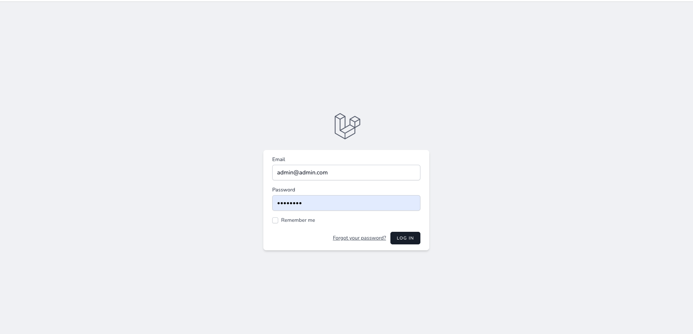
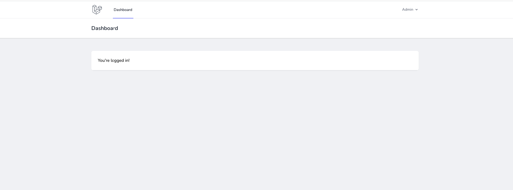
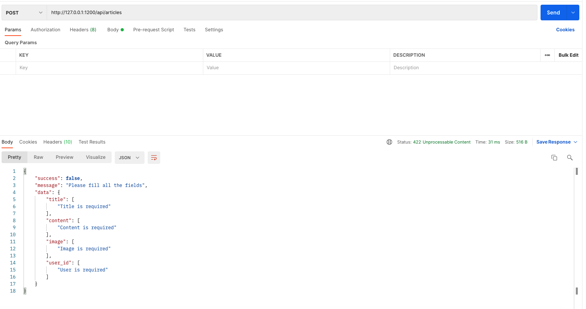
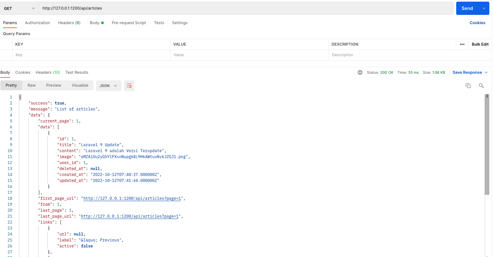
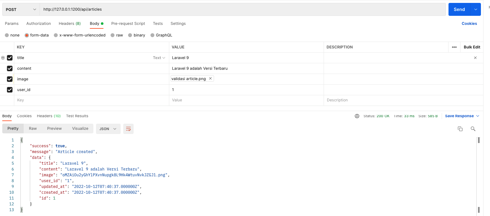
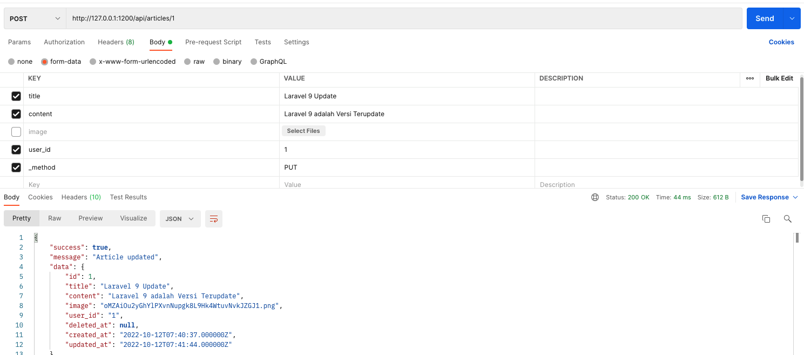
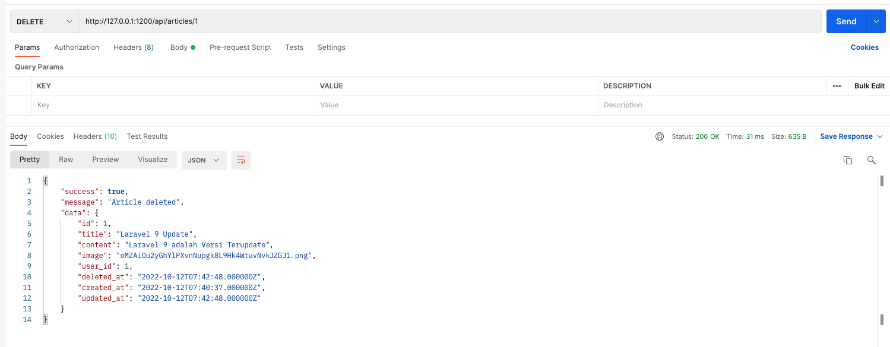

# Laravel Developer Test

built with Laravel 9.

## Concept

To aquire our objective, we need this features on the application:

- User can login.
- User can dashboard.
- User can see articles .
- User can update articles .
- User can delete articles .

- User can see API articles .
- User can update API articles .
- User can delete API articles .

## Getting Started
This application can be installed on local server and online server with these specifications :

#### Server Requirements
1. PHP >=8.0 ,
2. MySQL or MariaDB database,

#### Installation Steps

1. Clone the repo : `git clone https://github.com/syahrizal-alisadikin/laravel-developer-test.git`
2. `$ cd laravel-developer-test`
3. `$ composer install`
4. `$ cp .env.example .env`
5. `$ php artisan key:generate`
6. Create new MySQL database for this application  
(with simple command: `$ mysqladmin -urootuser -p create laravel_new`)
7. Set database credentials on `.env` file
8. `$ php artisan migrate`
9. `$ php artisan db:seed`
10. `$ php artisan storage:link`
11. `$ npm install && npm run dev` (not close npm run dev)
12. `$ php artisan serve` (open new tab terminal)

Starting Laravel development server: http://127.0.0.1:8000

## Screenshots

#### Login
##### email : admin@admin.com
##### password : password

#### Dashboard

#### Validation API

#### Articles API ALL

#### Articles API CREATE

#### Articles API UPDATE

#### Articles API DELETE

